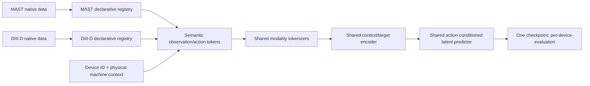

# Fusion-JEPA research and paper plan

**Status:** working specification, 2026-07-15  
**Target:** public preprint in late August or early September 2026; ICLR 2027
submission on the official schedule once announced  
**Working name:** Fusion-JEPA (rename before public release if needed)  
**Local starting point:** [IGNITE DIII-D world-model preprint](../reference/D3D_world_model_preprint/main.md)

## Executive decision

Build a **control-evaluable, action-conditioned, multi-horizon JEPA for
partially observed tokamak plasmas**. The paper should not be sold merely as
"the first JEPA in fusion." The publishable result is that latent predictive
pretraining learns a compact plasma state that is measurably more useful for
action-dependent prediction, low-label adaptation, robust state estimation,
and closed-loop control than reconstruction-first or raw-signal world-model
training.

The minimum credible evidence package is:

1. **Public experimental data:** reproducible representation and dynamics
   results on the official TokaMark benchmark built from the original MAST
   tokamak.
2. **Public control:** closed-loop target tracking and constraint evaluation in
   Gym-TORAX, using latent-space model-predictive control.
3. **Joint multi-device modeling:** one shared checkpoint trained jointly on
   MAST and DIII-D through a declarative signal schema, without a learned
   adapter, backbone, or dynamics head for each device.
4. **Real-device scale:** an internal DIII-D experiment showing that the same
   method scales to the IGNITE data surface and benefits from real actuator
   conditioning.
5. **Matched comparisons:** same backbone, parameter budget, data, optimizer
   budget, and seeds for JEPA versus raw-space prediction, masked
   reconstruction, and no-action ablations.

This is possible on the proposed schedule, but only if the team treats the
paper claim and evaluation protocol as the critical path. Frontier compute is
not the limiting resource. Data integration, trustworthy splits, action
identifiability, baselines, and writing are.

## Sixty-second paper pitch

Experimental fusion devices produce heterogeneous, incomplete observations of
a controlled dynamical system. Existing fusion foundation models largely learn
to reconstruct signals or forecast raw observations. Fusion-JEPA instead learns
the latent transition that is predictable from the current multimodal plasma
state and a future actuator program. We test whether that latent is not only
predictive, but **control-sufficient**: it should use the action channel, retain
the physical quantities needed for downstream tasks, remain stable over
rollouts and sensor loss, adapt with few labels, and support faster closed-loop
planning. We establish this on public MAST/TokaMark data and Gym-TORAX, then
train the same model jointly on MAST and internal DIII-D data to test whether a
single predictive state model can serve heterogeneous tokamaks.

## One-sentence technical thesis

Given a partially observed plasma history and a proposed actuator sequence,
predicting the future **representation** of the plasma at multiple horizons
produces a state that is more useful for prediction and control than predicting
every future measurement in signal space.

## What the paper is—and is not

### It is

- A representation-learning and world-model paper with a real scientific
  control application.
- An action-conditioned, multi-horizon JEPA adapted to heterogeneous time
  series, profiles, images/spectrograms, missing diagnostics, and continuous
  controls.
- A single jointly trained model whose learned modules are shared across
  devices and whose device interface is a declarative physical signal schema.
- A careful empirical answer to: "When does latent prediction help a
  partially observed, externally actuated physical system?"
- A public reproducibility story plus a private scale/replication story.

### It is not

- A claim that observational tokamak logs alone identify correct causal
  counterfactuals.
- A full replacement for IGNITE or an attempt to regenerate every DIII-D
  diagnostic at maximum fidelity.
- A promise of safe deployment on an operating tokamak by the ICLR deadline.
- A zero-shot claim for a tokamak that was absent from training. Adding an
  unseen device remains future work unless it is explicitly tested.
- An architecture-scale contest. A 10–15M parameter model with decisive,
  matched evidence is preferable to a 50M or 1B model with weak ablations.
- A paper whose only novelty is applying the JEPA acronym to fusion.

## Relationship to IGNITE

IGNITE already contains several ingredients of an action-conditioned latent
world model:

- modality-specific tokenizers for slow and fast time series, spectrograms,
  video, and actuator trajectories;
- a shared transformer that predicts the next token sequence;
- token-space autoregressive rollouts with fresh actuator tokens injected at
  each step;
- decoded signal-space losses over short and long rollouts; and
- a large internal DIII-D dataset spanning 8,600 filtered discharges from
  2018–2026, with ECH, gas, NBI, and RMP actuators.

Fusion-JEPA should reuse the data knowledge, tokenization lessons, masking
logic, and cluster infrastructure, but ask a different question:

> Can we remove the requirement to explain every raw future measurement and
> instead learn an action-sensitive latent state whose quality is demonstrated
> by downstream adaptation, joint-device training, and control?

The clean matched experiment is therefore not "Fusion-JEPA versus a completely
different IGNITE codebase." It is the same encoder/backbone budget trained with
different objectives:

1. decoded raw-space next-window or rollout prediction;
2. masked raw-space reconstruction;
3. latent prediction without actions;
4. action-conditioned latent prediction; and
5. action-conditioned latent prediction plus the chosen anti-collapse or
   action-sensitivity regularizer.

Do not reuse the IGNITE preprint's random train/validation/test split as the
only generalization test. The new paper needs an explicitly held-out temporal,
campaign, or experiment-family split in addition to any official/random split.

## Dataset correction: MAST is not MAST-U

TokaMark currently uses data from the original **Mega Ampere Spherical Tokamak
(MAST)**, not MAST Upgrade (MAST-U). FAIR-MAST covers historical MAST campaigns
M05–M09. Public-facing text, configs, tables, and filenames must say `MAST`
unless a separate MAST-U dataset is actually added and verified.

Current public facts relevant to planning:

- TokaMark exposes 14 tasks in four groups: reconstruction, magnetic dynamics,
  profile dynamics, and MHD activity.
- Its official code, split manifests, evaluation code, CNN baseline, and public
  Zarr-backed data are available.
- The Hugging Face package is approximately 388 GB compressed and the dataset
  card warns that unpacking requires approximately 2 TB.
- The dataset is derived from FAIR-MAST and is licensed CC BY-SA 4.0. Record
  the exact dataset revision and comply with attribution/share-alike terms for
  any redistributed derivative artifacts.

If actual MAST-U data becomes available, treat it as an additional OOD device
or campaign benchmark. Never silently mix it with the TokaMark split.

## Proposed problem formulation

Let the observed multimodal history be

\[
o_{t-L:t}=\{x^{(d)}_{t-L:t}, m^{(d)}_{t-L:t}\}_{d\in\mathcal D},
\]

where `d` indexes diagnostics and `m` is the validity/availability mask. Let
the future actuator program be

\[
u_{t:t+H}=\{u_t,\ldots,u_{t+H}\}.
\]

The context encoder, target encoder, and predictor are

\[
z_t=f_\theta(o_{t-L:t}),\qquad
z^*_{t+h}=f_{\bar\theta}(o_{t+h}),\qquad
\hat z_{t+h}=g_\phi(z_t,u_{t:t+h},h,e_{\rm device}),
\]

for several physical horizons `h`. The target branch is stop-gradient and may
be an exponential-moving-average encoder. The base objective is

\[
\mathcal L_{\rm pred}=\sum_{h\in\mathcal H}w_h\,
d(\hat z_{t+h},\operatorname{sg}(z^*_{t+h})),
\]

plus one deliberately chosen collapse-prevention term. Optional terms should
only be added when they answer a measured failure:

- action or latent-displacement decoding when the model ignores controls;
- variance/covariance or distribution regularization when latent rank
  collapses;
- rollout consistency when one-step quality does not survive planning;
- modality dropout when missing sensors break robustness or adaptation; and
- uncertainty prediction when partial observability creates irreducible
  multimodality.

Avoid a six-loss objective with no causal ablation. Every term in the final
method must have a failure diagnostic, an ablation, and a plain-language role.

## One jointly trained model across devices

The intended claim is **multi-device joint training**, not zero-shot transfer.
MAST and DIII-D examples participate in the same training run and update the
same model weights. At evaluation time, the same checkpoint handles either
device. A new device would still require a signal registry and training data;
the paper should not promise otherwise.

### Definition of "the same model"

Allowed device-specific information:

- a declarative mapping from native signal names to physical semantics, units,
  coordinates, roles, masks, and normalization statistics;
- a small learned signal-identity embedding and device-identity embedding;
- fixed device and shot metadata supplied as input tokens; and
- availability masks for signals that do not exist on a device.

Not allowed in the headline multi-device model:

- a separate tokenizer, encoder, predictor, dynamics head, LoRA module, or
  fine-tuned checkpoint for each device;
- branching model logic such as `if device == d3d: use d3d_network`;
- a device-specific output head carrying most of the task capacity; or
- silently using different objectives or optimizer schedules by device.

The concise engineering contract is:

> same checkpoint, same learned modules, different declarative signal
> registries.

This still requires a thin data adapter. Unit conversion, coordinate handling,
time alignment, and signal naming are scientific necessities, not avoidable
model complexity. The adapter should contain no learned parameters.

### Semantic token interface

Every observation or action token should expose enough metadata for shared
weights to interpret it:

\[
\tau = (v, t, q, r, m, c, s, d, p, a),
\]

where `v` is the value or local patch, `t` physical time, `q` semantic physical
quantity, `r` observation/action/target role, `m` modality, `c` physical or
spectral coordinates, `s` native signal identity, `d` device context, `p`
presence/validity mask, and `a` acquisition or actuator metadata.

Use shared tokenizer families by **modality**, not by device:

- one tokenizer for scalar/multichannel time-series patches;
- one for profiles on explicit physical or normalized-flux coordinates;
- one for time-frequency patches with frequency coordinates; and
- one for equilibrium/image-like fields with physical spatial coordinates.

Signal identity tells the tokenizer what a channel represents; it should not
select a different neural network. A fixed number of learned state/query tokens
can aggregate the variable input set into a compact latent state.

### Device conditioning

Use both:

1. an opaque learned `device_id` embedding, which lets the model represent
   genuine machine-specific dynamics; and
2. a physical machine-description token containing reviewed quantities such as
   major/minor radius, aspect ratio, field convention or nominal scale, and
   actuator/diagnostic capability metadata.

Shot-varying operating conditions such as toroidal field, plasma current,
shape, and configured heating belong in shot/state tokens rather than static
device metadata.

Required ablation:

- no device conditioning;
- device ID only;
- physical machine metadata only; and
- both.

The opaque ID will probably improve the two-device result, but the physical
metadata ablation establishes whether the model has learned more than two
unrelated lookup-conditioned functions. Do not use an adversarial objective to
erase device information initially: the domains have real physical
differences, and forced invariance can remove information needed for dynamics.

### Shared and device-specific signals

Do not restrict the model to only the exact intersection of MAST and DIII-D.
Use a layered surface:

1. **Shared core:** approximately 8–15 reviewed quantities covering plasma
   current/equilibrium summaries, density and temperature, energy or beta,
   heating/fueling, and the most comparable shape/control quantities.
2. **Shared structured modalities:** electron density/temperature profiles on
   a reviewed common coordinate, followed later by one genuinely comparable
   magnetic or radiation spectrogram family.
3. **Device-specific extras:** useful diagnostics or actuators represented by
   unique semantic/signal IDs and normal missingness masks, but processed by
   the same modality tokenizer and predictor.

For actuators, record both the physical command and a device-capability-normalized
value where meaningful. Preserve source identity for separate beams/coils; do
not pretend differently placed actuators are interchangeable merely because
both are measured in MW or volts.

Start with time series plus profiles. Add spectrograms only after the shared
core model passes. A few carefully aligned signals provide a cleaner ICLR
result than dozens of ambiguously mapped channels.

### Joint training recipe

- Alternate homogeneous-device batches for simple tensor shapes while using
  one optimizer and one shared parameter set.
- Sample devices approximately uniformly, or with tempered probability
  $p_d \propto N_d^\alpha$ for a predeclared $\alpha < 1$, so the larger window
  count cannot dominate.
- Normalize loss first within signal/modality and then within device before
  combining device losses.
- Use LayerNorm/RMSNorm rather than batch statistics that silently encode the
  current device batch.
- Apply channel/modality dropout so the shared encoder cannot rely on a fixed
  sensor inventory.
- Log metrics and latent collapse diagnostics separately for each device as
  well as jointly.
- Periodically measure per-device gradient cosine/conflict. Only introduce
  gradient balancing methods if ordinary balanced sampling shows a measured
  conflict.

No cross-device latent-alignment loss is required for version 1. The JEPA target
for a MAST example comes from MAST and the target for a DIII-D example comes
from DIII-D. Shared weights, semantic tokens, balanced training, and downstream
evidence should establish whether useful structure is shared.

### Parameter budget

Keep the headline checkpoint at approximately 10–15M deployed parameters, with
approximately 12M as the configuration target. A reasonable allocation is
6–8M for a shared context encoder, 1–2M for shared tokenizers and
semantic/device embeddings, 2–4M for the latent predictor, and at most 1M for
query/probe heads. For example, start near six encoder blocks at width 320 and
three predictor blocks at width 256, then adjust from measured throughput and
capacity. The EMA target encoder adds a training-time weight copy but is not a
separate deployed model.

The multi-device argument is stronger at 10–15M than at 50M or 1B: one compact
model can replace multiple specialists and can support dense batched latent
planning. Use roughly 4M, 12M, and 40M for the scaling curve; the 40M model is a
capacity check, not the default.

## Recommended method ladder

Implement and test these in order. Do not begin with the most elaborate
version.

### M0: raw-space matched world model

The same modality encoders and shared backbone predict decoded future signals.
This is the main objective-control and compute-matched baseline.

### M1: EMA action-conditioned JEPA

- Online context encoder.
- EMA target encoder with stop-gradient.
- Continuous actuator-sequence tokenizer.
- Horizon embedding and optional device embedding.
- Multi-horizon latent regression.
- Lightweight variance/covariance monitoring and regularization.

This is the fastest credible core model.

### M2: stable end-to-end JEPA variant

Compare the EMA design with a LeWorldModel/LeJEPA-style distribution
regularizer. This is where the collaborator with JEPA expertise can contribute
decisively. Do not assume that a pixel-derived isotropic Gaussian prior is
optimal for mixed plasma modalities; measure latent rank, covariance, and probe
quality.

### M3: action-sensitive transition geometry

If actions are ignored, add an inverse-dynamics or latent-displacement action
head. Delta-JEPA already makes this a known idea, so it cannot be presented as
the paper's algorithmic novelty. The fusion contribution is the rigorous test
of action sensitivity across continuous multi-actuator, multi-timescale plasma
dynamics, and any genuinely new extension must be stated separately.

### M4: rollout/control variant

Train short latent rollouts and use them in receding-horizon CEM or MPPI. Only
promote long-horizon latent rollout to the main method if closed-loop control
improves; low latent MSE by itself is not enough.

### M5: optional uncertainty-aware predictor

An ensemble or probabilistic latent predictor is a stretch goal. Use it only if
calibrated uncertainty improves safe action selection or OOD detection. Do not
let this block the preprint.

## Three primary claims and their gates

The abstract should contain no claim that does not pass its gate.

### Claim 1 — useful predictive state

**Candidate claim:** action-conditioned latent prediction produces more
transferable and label-efficient plasma representations than raw reconstruction
or supervised-from-scratch training.

**Required evidence:**

- official TokaMark metrics on dynamics tasks;
- frozen linear probes and low-label fine-tuning at 1%, 5%, 10%, and 100%;
- matched backbone/parameter/optimizer/data budgets;
- at least three seeds for full runs and five for cheap probes/ablations;
- shot-level confidence intervals and paired comparisons; and
- gains on more than one task family, not a single cherry-picked target.

**Gate:** statistically credible improvement in either aggregate dynamics
quality or low-label area-under-the-data-fraction curve, with no catastrophic
regression in another task group.

### Claim 2 — the latent actually uses actions

**Candidate claim:** Fusion-JEPA learns action-sensitive transition geometry,
not an action-averaged predictor.

**Required evidence:**

- real-action versus zeroed, shuffled, time-shifted, and cross-shot actuator
  ablations;
- inverse-action prediction from `z_{t+h}-z_t`;
- predicted response curves under bounded action perturbations;
- comparison against an otherwise identical no-action JEPA; and
- closed-loop simulator evidence, where counterfactual action outcomes are
  observable.

**Gate:** real actions improve held-out future prediction over matched shuffled
actions, the action channel is recoverable from latent transitions above a
pre-registered threshold, and simulator rollouts respond in the correct
direction to at least the primary actuators.

**Causal language rule:** action-ablation results on logged MAST or DIII-D data
show action utilization, not correct counterfactual prediction. Reserve causal
or counterfactual claims for Gym-TORAX or a separately validated simulator/
experiment.

### Claim 3 — useful for control

**Candidate claim:** Fusion-JEPA supports faster or better closed-loop plasma
control than raw-space learned world models under the same data and planning
budget.

**Required evidence:**

- a public Gym-TORAX task with fixed observations, actuators, reward/targets,
  constraints, and episode seeds;
- receding-horizon control using the learned latent predictor;
- raw-space world model, behavior controller, and available oracle/model-based
  controller baselines;
- target tracking, constraint violations, action smoothness/effort, success
  rate, and wall-clock planning latency; and
- robustness to sensor dropout and simulator-parameter shift.

**Gate:** better tracking or success at comparable safety, or comparable
control with materially lower planning latency. "Latent loss is lower" does
not pass this gate.

## High-value fourth claim

### Claim 4 — one jointly trained model serves multiple devices

**Candidate claim:** a single device-conditioned Fusion-JEPA can be trained
jointly on heterogeneous, partially overlapping MAST and DIII-D observations
and actions, without per-device learned adapters, while matching specialist
models and improving the efficiency of the combined system.

**Required evidence:**

- one frozen headline checkpoint evaluated on held-out campaigns from both
  devices;
- no device-specific tokenizer, backbone, predictor, head, LoRA, or fine-tuned
  weights in that checkpoint;
- comparison with an approximately 12M specialist trained separately on each
  device;
- comparison with two approximately 6M specialists having the same total
  deployed parameter budget as the joint approximately 12M model;
- common-signals-only versus common-plus-device-specific-signals comparison;
- device-conditioning ablation: none, opaque ID, physical metadata, and both;
- per-device losses, shot-level intervals, and compute/data accounting;
- a reduced-data experiment showing whether joint training helps when one
  device contributes fewer shots; and
- release of the shared model/schema/evaluation code and, if approved, the
  joint checkpoint; otherwise an explicit statement that the multi-device
  result cannot be independently reproduced from the private DIII-D data.

**Gate:** using a non-inferiority margin declared before test evaluation, the
same checkpoint is statistically non-inferior to the matched approximately 12M
specialist on each device and either improves at least one predeclared
device/task regime or achieves comparable performance with materially lower
total model storage/maintenance. A win only in the pooled average while one
device degrades substantially does not pass.

**Language rule:** call this multi-device joint training or a multi-device
world model. Do not call it zero-shot transfer, plug-and-play deployment on an
unseen machine, or device invariance. The model has seen training data from
every claimed device.

This claim is a strong ICLR differentiator if it passes. If it does not, retain
the shared schema as an engineering capability and keep action-sensitive
prediction/control as the paper's central scientific claim.

## Public benchmark plan: TokaMark

Use the upstream split and metrics for leaderboard comparability, then add one
harder temporal/campaign OOD split. Never modify official test labels or split
membership while tuning.

### Official task inventory

| Group | Tasks | Core target | Context / horizon | Priority |
|---|---|---|---|---|
| 1 Reconstruction | 1-1, 1-2, 1-3 | equilibrium scalars, LCFS, poloidal flux | 5 ms to same-window target | Secondary; probes state content |
| 2 Magnetic dynamics | 2-1, 2-2, 2-3 | currents/equilibrium, LCFS, poloidal flux | 5 ms input, 25 ms future; PF voltage and NBI conditioning | Must-run |
| 3 Profile dynamics | 3-1, 3-2, 3-3 | Thomson profiles; radiation/SXR; profiles and beta | 5–150 ms input, 5–50 ms future; scheduled current/density, NBI, gas | Must-run |
| 4 MHD activity | 4-1…4-5 | SXR, vertical position, plasma current, magnetic activity | 150 ms input, 100 ms future with actuators | Must-run, highest control relevance |

### Release sequence

1. Download and pin upstream `tokamark`, `tokamark_baseline`, dataset revision,
   and split manifest.
2. Run sample data and official persistence/CNN evaluation unmodified.
3. Materialize a small development subset containing every modality and
   missing-data pattern.
4. Validate units, sample rates, window boundaries, masks, and shot IDs with a
   physics collaborator.
5. Train on task groups 2 and 3 first; they give the quickest action-conditioned
   signal.
6. Add group 4 once non-Markovian windows and high-rate modalities are stable.
7. Run group 1 as frozen representation probes rather than optimizing the
   entire project around reconstruction.

### TokaMark evaluation beyond the official metrics

- Official NRMSE, NMAE, RMSE, and MAE at window, shot, signal, task, and group
  level.
- Frozen linear and two-layer probes.
- Fine-tuning curves versus labeled fraction and number of optimizer steps.
- Sensor-drop curves: random channel dropout, complete modality removal,
  contiguous final-window loss, and actuator-channel loss.
- Calibration or ensemble disagreement if uncertainty is implemented.
- Latent effective rank, per-dimension variance, covariance spectrum, and
  nearest-neighbor physical consistency.
- Latent rollout error versus horizon.
- Action predictive gain: error with shuffled actions minus error with real
  actions.
- Wall-clock throughput and peak memory at matched hardware.

## Public closed-loop control plan: Gym-TORAX

TokaMark is an experimental forecasting benchmark; it cannot by itself validate
counterfactual control. Gym-TORAX provides a public Gymnasium interface around
the differentiable TORAX core-transport simulator and currently includes an
ITER ramp-up environment. Use it to make the control claim falsifiable and
reproducible.

### First control task

Keep the initial task narrow:

- track one or two core/profile targets available in the environment;
- actuate a small continuous action set such as heating/current-drive and
  fueling controls exposed by Gym-TORAX;
- penalize hard physical/operational constraint violations;
- include action-rate and action-magnitude costs; and
- evaluate under fixed nominal, parameter-shift, and sensor-dropout suites.

The physics/control collaborators must approve the observation, action,
constraint, and target definitions before results are run.

### Offline data and planners

- Generate a fixed offline trajectory dataset using safe randomized controls,
  built-in controllers, or a mixture. Freeze and hash the dataset.
- Train all learned dynamics baselines on exactly the same trajectories.
- Use CEM or MPPI first; avoid inventing a new planner unless planning itself is
  the contribution.
- Replan at every control interval and report both model calls and wall time.
- Keep an oracle simulator-based planner, if computationally feasible, as an
  upper bound rather than a directly fair learned-model baseline.

### Control metrics

- integrated and terminal tracking error;
- episode success rate;
- number, magnitude, and duration of constraint violations;
- action energy and total variation;
- recovery after perturbation;
- model/planner latency and number of candidate rollouts;
- performance under observation noise, missing channels, and domain shift; and
- mean, standard deviation, and confidence interval across fixed episode seeds.

## Internal DIII-D plan

The private result should demonstrate scale and real-device relevance without
making the paper impossible to reproduce.

### Phase A: aligned low-dimensional surface

Start with the signals most comparable to public data and control objectives:

- plasma current and equilibrium summaries;
- electron density and temperature profiles;
- NBI, gas, ECH, and other verified actuator channels;
- one instability-relevant diagnostic if data quality is adequate; and
- explicit masks and physical time.

Use the same approximately 10–15M headline configuration and matched baselines.
Only run the approximately 40M capacity check after this finishes and before
attempting the complete IGNITE multimodal surface.

### Phase B: multimodal scale

Add selected high-rate spectrograms and video only after the central claims
pass. The reason to include them must be downstream value—not merely model
size.

### DIII-D split requirements

- no windows from the same shot across splits;
- add a chronological/campaign holdout;
- identify repeated experimental programs or near-duplicate actuator recipes
  and group them where possible;
- compute normalization on training data only;
- freeze split manifests before full experiments; and
- publish aggregate split statistics even if shot IDs/data cannot be released.

### Private-data reproducibility strategy

- Every headline method claim must have a public analogue on TokaMark or
  Gym-TORAX.
- Clearly label DIII-D as non-public/internal.
- Release configs, model code, metric code, and synthetic/sample schemas.
- Report exactly which results cannot be independently reproduced.
- Do not let a private-only result carry the central comparison.

## Baseline matrix

### Required

1. Persistence / identity.
2. Official TokaMark CNN baseline.
3. LSTM or causal Transformer trained from scratch.
4. Same-backbone supervised raw-space future prediction.
5. Same-backbone masked autoencoding/reconstruction.
6. Same-backbone JEPA without actions.
7. Same-backbone action-conditioned JEPA.
8. The final method with its extra regularizer, if any.
9. A separate approximately 12M specialist for each device.
10. Two approximately 6M specialists whose combined deployed parameter count
    matches the joint approximately 12M checkpoint.

### Strong additions

- TokaMind using released weights/code when compatible.
- A time-series SSL baseline such as TS2Vec/CPC and a masked latent predictor.
- LeWorldModel/LeJEPA-style stable end-to-end objective.
- Delta-JEPA-style action-decoding objective.
- IGNITE checkpoint or reduced matched IGNITE objective on DIII-D.
- Neural ODE/state-space baseline for the low-dimensional control surface.

### Fairness rules

- Report parameter count, tokens/window, training examples, optimizer steps,
  accelerator-hours, and fine-tuning budget.
- Compare both equal-model-size and equal-compute settings when feasible.
- Tune baselines on validation data with a documented search budget.
- Do not compare a fully tuned JEPA to an upstream baseline run with defaults
  only.
- Use identical public splits and preprocessing unless the experiment is
  explicitly labeled as a new split.
- Balance device sampling and loss aggregation explicitly; report the number
  of shots, windows, tokens, and optimizer contributions from each device.
- Compare joint and specialist models on each device separately before showing
  any pooled aggregate.

## Core ablation matrix

| Question | Comparison |
|---|---|
| Does latent prediction help? | raw-space prediction vs JEPA, same backbone |
| Do actions matter? | real actions vs no actions vs shuffled/time-shifted actions |
| Does multi-horizon training help? | single 5/25/50/100 ms horizon vs joint horizons |
| What prevents collapse? | EMA only vs variance/covariance vs SIGReg-style regularization |
| Does the model need every sensor? | no dropout vs channel/modality dropout curriculum |
| Does rollout training help control? | one-step vs short rollout fine-tuning |
| Does joint training help? | joint checkpoint vs per-device specialists, per device |
| How should device be represented? | no conditioning vs ID vs physical metadata vs both |
| Can partially overlapping signals coexist? | shared core only vs shared core plus device-specific extras |
| Is there useful data sharing? | joint vs specialist under reduced shots from one device |
| Does pretraining help downstream tasks? | frozen, low-label fine-tune, and scratch |
| Is scale responsible? | small/medium model scaling at fixed data and objective |
| Is the latent physically meaningful? | probes, nearest neighbors, transition Jacobians |
| Is the control result planner-specific? | at least CEM plus one alternative or sensitivity sweep |

Pre-register the smallest ablation set that can falsify the headline mechanism.
Extra model variants are lower priority than complete seeds and trustworthy
baselines.

## Statistics and reporting contract

- The atomic evaluation unit is a **shot** or control episode, not an
  overlapping window.
- Use a paired shot-level bootstrap for confidence intervals and comparisons.
- Report all seeds, not only the best checkpoint/seed.
- Aggregate tasks only after defining normalization and weighting; report the
  disaggregated table beside any average.
- Fix one primary metric per claim before large runs.
- Track test access. No iterative test-set tuning.
- Include negative results that determine the final design, especially action
  ignoring or collapse.
- Show absolute values and effect sizes, not only percent improvements.
- Report training and inference cost.

Suggested primary metrics:

- Claim 1: low-label normalized error area under the data-fraction curve,
  averaged over pre-declared dynamics tasks.
- Claim 2: action predictive gain plus inverse-action probe performance.
- Claim 3: closed-loop integrated tracking error subject to a fixed maximum
  constraint-violation rate.
- Claim 4: worst-device normalized performance gap between the joint checkpoint
  and its matched specialist, with a separate reduced-data sharing curve.

## Reviewer bar

The latest published ICLR reviewer guide asks four core questions: what problem
is tackled, whether the approach is motivated and situated, whether evidence
supports the claims rigorously, and whether the work contributes significant
new knowledge. Design the paper so each question has a one-paragraph answer.

### Likely reviewer objection: "This is only a domain application"

Response must come from the experiments, not rhetoric:

- matched objective study revealing when latent prediction helps;
- a control-sufficiency evaluation battery useful beyond fusion;
- multi-rate, partial-observation, continuous-action setting not covered by
  standard visual JEPA benchmarks; and
- public data/code/control evaluation.

### Objection: "The latent is not shown to be useful"

Need frozen/low-label probes, action tests, and closed-loop planning. Decoded
forecast plots alone are insufficient.

### Objection: "Actions are ignored or confounded"

Need action ablations and simulator control. Explicitly limit causal claims on
logged data.

### Objection: "The gains come from a larger transformer or more compute"

Need matched architecture and compute ablations.

### Objection: "Private DIII-D data makes the paper irreproducible"

Need every central claim on public MAST or Gym-TORAX, with DIII-D framed as a
replication/scale result.

### Objection: "The device token just hides two separate models"

Need a single parameter graph, no device-specific learned modules, conditioning
ablations, shared-signal/device-specific-signal ablations, per-device results,
and comparison against explicit specialists. Show whether joint training gives
positive data sharing or model consolidation rather than relying on a pooled
metric.

### Objection: "TokaMark already has TokaMind"

Need a different question: control-sufficient latent dynamics, action
sensitivity, label efficiency, robustness, and closed-loop planning—not merely
lower benchmark NRMSE.

### Objection: "First fusion JEPA is not novel"

Agree in the paper. Treat priority as context, not the reason for acceptance.
The reason for acceptance is new empirical knowledge and a useful, rigorously
evaluated method.

### Objection: "No real tokamak deployment"

Do not imply deployment. State that control is validated in a public simulator
and predictive/joint-model behavior is validated on real experimental data. A
future experimental deployment is a separate milestone.

## Success levels

### Minimum preprint worth releasing

- method is stable and non-collapsed;
- official public data pipeline and split are pinned;
- at least one full public dynamics group with matched baselines and seeds;
- action ablation passes;
- one complete Gym-TORAX control task beats a nontrivial baseline or shows a
  compelling speed/quality tradeoff;
- code for the public result is runnable; and
- paper makes no unsupported unseen-device, invariance, or causal claim.

### Credible ICLR submission

- all required claims pass;
- TokaMark covers multiple task groups;
- control evaluation includes robustness and constraints;
- private DIII-D replication is complete;
- if Claim 4 is advertised, one joint MAST/DIII-D checkpoint passes the
  per-device specialist gate;
- matched objective and compute ablations are complete;
- paper and supplement contain reproducibility detail; and
- main figures/tables have confidence intervals and full baseline context.

### Strong submission

- joint training improves a predeclared reduced-data regime on one device
  without degrading the other;
- latent MPC is materially faster and at least as effective as raw-space
  planning;
- a simple method insight generalizes beyond fusion; and
- code, weights, split manifests, and public checkpoints are released.

## Feasibility and schedule

### Deadline caveat

As of 2026-07-15, an official ICLR 2027 call/deadline was not located. The
latest published cycle used an abstract deadline on September 19 and a full
paper deadline on September 24 (AOE). Use those dates only as a planning proxy
and replace them immediately when ICLR 2027 posts its rules.

The latest published rules also allowed arXiv preprints, required a genuine
abstract and fixed author list around the abstract deadline, locked the paper
between submission and review release, and allowed revisions during public
discussion. Reviewers were not required to inspect every revision. Re-check all
of these for ICLR 2027.

### Calendar plan

| Date | Deliverable | Exit criterion |
|---|---|---|
| Jul 15–18 | Scope freeze | thesis, claim gates, data roles, primary metrics, and owners agreed |
| Jul 15–24 | TokaMark acquisition/integration | pinned dataset/code; sample and full-storage validation; official baseline runs |
| Jul 20–31 | Model v0 | M1 JEPA trains without collapse on groups 2/3 subset; action/no-action smoke result |
| Jul 27–Aug 7 | Full public training | required matched baselines and first full task group across seeds |
| Aug 3–14 | DIII-D aligned subset | frozen split; scratch/raw/JEPA comparison running |
| Aug 7–18 | Joint multi-device model | same 10–15M checkpoint trains on MAST and DIII-D; specialist and conditioning ablations running |
| Aug 3–14 | Gym-TORAX environment | approved control contract, frozen offline trajectories, baseline controller |
| Aug 10–21 | Closed-loop result | latent planner runs; safety/tracking/latency table complete |
| Aug 17–26 | Full ablations | objective, action, horizon, collapse, robustness, and data-fraction studies |
| Aug 20–28 | Paper v1 | all main figures/tables populated; no placeholder central results |
| Aug 31 | Preprint release target | minimum release bar passes; public code/checkpoint or exact release plan |
| Sep 1–10 | Strengthening | OOD split, scale, joint-data-sharing study, extra seeds, reviewer stress test |
| T−14 days | Authorship freeze | every author has concrete contribution and required profile |
| T−7 days | ICLR paper freeze | nine-page-style main story complete under current template |
| T−2 days | Submission QA | anonymity, supplement, licenses, profiles, checksums, reproducibility |

### Honest probability assessment

- **Late-August/early-September preprint:** feasible if scope is the aligned
  time-series/profile model plus one public control task. Estimated likelihood
  is high with dedicated owners and daily experiment triage.
- **Credible ICLR submission:** feasible but schedule-sensitive. The biggest
  threat is not training time; it is waiting too long for data/metric and
  control-task decisions.
- **Joint MAST/DIII-D checkpoint:** feasible at approximately 10–15M parameters if
  the shared signal surface and device balancing policy are frozen by late
  July. It becomes a schedule threat if every diagnostic is included at once.
- **Full multimodal, many-device, long-horizon, uncertainty-aware foundation
  model by submission:** not a responsible base plan. Treat as stretch work.

## Workstreams and ownership

Assign one directly responsible person to each row. Names below are role
suggestions, not authorship promises.

| Workstream | Owner profile | Concrete deliverable |
|---|---|---|
| Paper lead / integration | project lead | thesis, decisions, daily triage, paper and release |
| Public data | ML/data engineer | pinned TokaMark pipeline, manifests, throughput, official baseline |
| JEPA method | JEPA collaborator | objective, collapse diagnostics, matched method ablations |
| Physics validity | fusion physicist(s) | signal map, units, masks, perturbation bounds, result sanity checks |
| Control benchmark | control expert | Gym-TORAX task, constraints, controllers, closed-loop evaluation |
| DIII-D experiment | IGNITE/data owner | aligned dataset, split, internal comparison, release-safe aggregates |
| Time-series evaluation | Ravid Ziv or equivalent | baseline suite, low-label protocol, statistics, representation probes |
| Infrastructure | Frontier owner | data staging, jobs, checkpoints, experiment registry, cost accounting |

### How to involve the collaborator from Yann LeCun's lab

Give them ownership of a decision that changes the scientific result, not a
generic request to "help with JEPA":

1. choose and justify EMA versus stable end-to-end regularization;
2. define collapse and latent-geometry diagnostics;
3. design the minimal matched comparison to LeWorldModel/LeJEPA and
   Delta-JEPA-style objectives; and/or
4. co-own the latent planning/control ablation.

Ask for a written two-page method/evaluation decision and one implemented or
analyzed workstream by early August.

### How to approach Yann LeCun

Do not lead with only "first JEPA for fusion." Lead with a concrete scientific
problem and one early plot:

- partially observed, multi-rate, continuously actuated real physical system;
- public benchmark plus closed-loop simulator;
- a measured failure of ordinary JEPA or a clear advantage of the proposed
  latent; and
- a precise ask: 30 minutes of technical feedback, advice on collapse/control
  sufficiency, or active collaboration on a named workstream.

Authorship should follow a substantive contribution. Because recent ICLR rules
locked authors around the abstract deadline, any potential author must be
engaged well before that date; do not add honorary authorship.

### How Ravid Ziv could contribute

The most valuable bounded role is the time-series and evaluation spine:

- choose serious temporal SSL and supervised baselines;
- audit overlapping-window leakage and campaign shift;
- own low-label transfer curves and statistical aggregation;
- test whether the latent captures regime/instability structure; and
- help decide whether multi-horizon prediction or uncertainty is genuinely
  useful.

## Decision log: resolve immediately

### D1 — central paper claim

**Recommended:** useful and action-sensitive latent state, proven by public
control.  
**Status:** OPEN until team sign-off.

### D2 — public control environment

**Recommended:** Gym-TORAX ITER ramp-up with one narrow target-tracking task.  
**Fallback:** another independently validated open simulator, documented before
training.  
**Status:** OPEN pending control-team validation.

### D3 — target encoder / collapse strategy

**Recommended starting point:** EMA target encoder plus simple variance/
covariance safeguards; compare to end-to-end SIGReg-style objective.  
**Status:** OPEN pending first-week collapse study.

### D4 — DIII-D public wording and release constraints

Confirm what aggregate metrics, signal names, checkpoint/code components, and
figures can be released.  
**Status:** OPEN.

### D5 — actual ICLR 2027 dates and policy

Replace proxy dates and re-audit author, anonymity, preprint, page-limit, and
revision rules as soon as the official guide appears.  
**Status:** OPEN / monitored.

### D6 — first multi-device signal surface

Approve an approximately 8–15 quantity shared core, the allowed device-specific
extras, coordinate conventions, machine metadata, device sampling weights, and
the exact definition of "no learned device adapter."  
**Status:** OPEN; must close before the joint loader/model implementation.

## Next 72 hours

1. Hold a 45-minute scope meeting and approve or change D1–D4.
2. Assign owners for public data, method, control, DIII-D, and paper.
3. Start the TokaMark download to project work storage and pin exact upstream
   revisions.
4. Run the official sample-data pipeline and persistence/CNN evaluation.
5. Have the physics/control team define a one-page Gym-TORAX control contract.
6. Freeze primary metrics and public split policy.
7. Implement only the M1 small action-conditioned JEPA smoke test.
8. Create a shared result board with one row per required experiment and no
   unregistered runs.
9. Send the JEPA collaborator a bounded method/diagnostics ownership proposal.
10. Schedule a go/no-go review for July 31.
11. Have MAST and DIII-D owners draft and physics-review the shared semantic
    signal registry plus device-description fields.

## Go/no-go reviews

### July 31

Continue with the ICLR target only if:

- public data and official metrics run end to end;
- the JEPA does not collapse;
- real actions outperform shuffled/no actions on at least one dynamics task;
- at least one matched raw-space baseline is complete; and
- the control benchmark is specified and generating data.

If actions add no signal, first diagnose behavior-policy coverage and temporal
alignment. If still negative, move the control claim to Gym-TORAX and position
MAST as representation pretraining rather than pretending logged MAST actions
support counterfactual control.

### August 14

The paper needs:

- a complete public task-group table;
- low-label transfer curve;
- action-sensitivity figure;
- a working closed-loop planner; and
- a DIII-D aligned-subset result; and
- one same-checkpoint MAST/DIII-D smoke run with no learned device-specific
  modules.

If closed-loop control is not working, narrow the target/action space before
adding model complexity.

### August 26

Release the preprint only if the minimum release bar passes. A weak priority
claim with unreproducible results may harm the project more than a one-week
delay.

## Paper outline

1. **Introduction:** controlled plasma as a partially observed physical system;
   gap between reconstruction/forecasting and control-sufficient state.
2. **Related work:** fusion foundation/world models, latent plasma dynamics,
   JEPA/time-series world models, learned control/MPC.
3. **Problem:** multi-rate observations, partially overlapping device signal
   sets, missing sensors, continuous action programs, multi-horizon latent
   prediction.
4. **Method:** semantic modality tokenization, device/physics conditioning,
   shared context/target encoders, action-conditioned predictor, deliberately
   minimal anti-collapse term.
5. **Control-sufficiency battery:** low-label task adaptation, action use,
   rollout stability, robustness, and closed-loop metrics.
6. **Public experimental results:** TokaMark official and OOD splits.
7. **Public control results:** Gym-TORAX.
8. **Joint real-device model:** one MAST/DIII-D checkpoint versus specialists.
9. **Ablations and analysis:** objective, action, device conditioning, signal
   overlap, horizon, collapse, scaling, and compute.
10. **Limitations:** observational confounding, simulator gap, missing public
    DIII-D data, no machine deployment, device-specific semantics.

## Main figures to earn

1. Architecture and data-flow figure emphasizing action trajectory and target
   latent, not decoders.
2. Matched objective comparison across TokaMark task groups and label fractions.
3. Action-sensitivity figure: true versus shuffled/no action plus latent
   displacement probe.
4. Closed-loop Gym-TORAX tracking/safety/latency Pareto plot.
5. Per-device joint-model versus specialist comparison, including total model
   footprint and a reduced-device-data curve.
6. Latent analysis: rank/collapse, physical probes, and rollout horizon.

Do not reserve a main figure for a visually attractive decoded trajectory unless
it supports a claim above.

## Ideas backlog, ordered by expected value

### High value / low to medium risk

- multi-horizon target sampling rather than strictly autoregressive training;
- channel and modality dropout matched to diagnostic failures;
- action-shuffle negatives and inverse-action probes;
- chronological/campaign OOD split;
- physically normalized semantic signal registry across devices;
- device-balanced joint MAST/DIII-D training with one shared checkpoint;
- specialist versus joint-model parameter/accounting comparison;
- low-label and frozen-probe evaluation;
- latent MPC with a simple standard planner;
- matched raw versus latent compute/latency comparison;
- event-balanced sampling for rare MHD transitions; and
- rollout curriculum only after one-step stability.

### Medium value / medium risk

- uncertainty ensemble for safe planning;
- energy-based latent goal cost;
- explicit latent curvature/straightening regularizer for planning;
- extending the device-conditioned shared backbone to TORAX;
- physics-variable auxiliary probes used for evaluation only;
- intervention-aware synthetic pretraining in TORAX followed by real-data
  adaptation; and
- retrieval of historical action programs using latent state similarity.

### High risk / stretch

- billion-parameter full IGNITE multimodal conversion before the first result;
- end-to-end video/spectrogram/profile/control at all sampling rates;
- causal counterfactual claims from logged data alone;
- a new planner, new JEPA objective, new uncertainty model, every modality, and
  many-device foundation model in one paper;
- real tokamak deployment by the submission deadline; and
- using IGNITE as the sole evaluator of Fusion-JEPA-planned actions.

## Risk register

| Risk | Early indicator | Mitigation |
|---|---|---|
| Actions are weak/confounded in MAST | shuffled actions do not hurt | move causal/control proof to Gym-TORAX; inspect alignment/coverage |
| Representation collapse | low variance/effective rank; constant predictions | EMA target; variance/SIGReg study; log diagnostics every run |
| TokaMark I/O dominates | low GPU utilization, many small reads | local Orion copy, Zarr/shard tuning, cache, benchmark loader first |
| Baseline gap is unfair | different params/updates/preprocessing | shared backbone and experiment registry; matched configs |
| Larger device dominates | joint model improves DIII-D but hurts MAST | tempered device sampling, per-device loss normalization, worst-device gate |
| Device token hides specialists | no-ID model fails and ID-conditioned paths diverge | prohibit device-specific modules; physical-metadata ablation; compare shared gradients/features |
| Signal semantics are falsely aligned | shared-name channel has different physics/coordinates | physics-reviewed registry; retain distinct IDs when uncertain; begin with a small core |
| Private result dominates story | public gains weak | block submission claim until public result passes |
| Model works for prediction, not control | low latent error, poor MPC | action/rollout diagnostics; narrow control task; train on planner distribution |
| Simulator exploitation | high nominal reward, poor shifted performance | parameter randomization, constraints, OOD suite, physics audit |
| Timeline expands | new modalities/objectives before gates | enforce method ladder and go/no-go reviews |
| Novelty is overtaken | new fusion/JEPA preprint appears | weekly primary-source search; update positioning, do not rely on "first" |
| Author list unresolved | senior collaborators contacted late | concrete ownership by early August; freeze before official abstract deadline |
| Test leakage | surprising near-perfect window metrics | shot/campaign manifests, hash checks, leakage tests |

## Priority and literature-watch protocol

Run a living literature check at least weekly through submission using primary
paper/repository sources. Search combinations of:

- `tokamak JEPA`, `fusion JEPA`, `plasma joint embedding predictive`;
- `action-conditioned JEPA time series`;
- `latent world model tokamak control`;
- `fusion foundation model control representation`;
- `multi-machine tokamak model`, `joint tokamak foundation model`, and
  `device-conditioned plasma model`; and
- new arXiv/OpenReview work citing TokaMark, TokaMind, PanoMHD, FusionMAE,
  V-JEPA 2, LeWorldModel, Delta-JEPA, and time-series JEPAs.

Maintain a dated table of title, submission date, exact overlap, and response.
Never state "first" from memory. Use "to our knowledge" only after the final
search, define the category precisely, and make the paper valuable even if the
priority claim disappears.

## Current nearest-work implications

- **TokaMind:** already brings multimodal transformer pretraining to public MAST
  and outperforms the official baseline on most TokaMark tasks. Fusion-JEPA must
  win on action/control/joint-device evidence, not the existence of pretraining.
- **Existing multi-machine disruption predictors:** already demonstrate joint
  or shared modeling across C-Mod, DIII-D, and EAST. Do not claim the first
  multi-tokamak neural model. The narrower novelty target is a heterogeneous,
  action-conditioned predictive representation/world model with one shared
  checkpoint and no learned per-device adapters.
- **DisruptionPy and IMAS:** establish that standardized multi-machine signal
  preparation and machine-agnostic physical schemas are active community
  directions. Reuse their naming/coordinate ideas where appropriate instead of
  inventing incompatible terminology; the paper contribution is the learned
  model and evidence, not a competing data standard.
- **PanoMHD:** already frames causal multimodal forecasting toward tokamak
  control and predicts magnetic fluctuation signals. Avoid claiming that
  control-conditioned fusion prediction is new in general.
- **FusionMAE:** already uses masked reconstruction to learn a control-diagnosis
  interface. It is a direct objective baseline.
- **AUG latent dynamics and DIII-D full-shot models:** latent plasma-state
  dynamics and full-shot prediction predate this project. The novelty is the
  JEPA objective plus control-sufficiency evidence, not latent dynamics alone.
- **V-JEPA 2-AC:** establishes the action-conditioned JEPA/planning blueprint.
- **LeWorldModel/LeJEPA:** makes stable end-to-end training and collapse
  regularization a central comparison.
- **Delta-JEPA:** makes latent-displacement action decoding prior work as of
  June 2026; cite rather than rediscover it.
- **Recent time-series JEPAs:** mean that "JEPA for time series" is not a
  contribution by itself.
- **Gym-TORAX:** makes a public fusion control evaluation possible within the
  schedule.

## Source snapshot (accessed 2026-07-15)

Primary/current sources used to define this plan:

- [ICLR 2026 Call for Papers](https://iclr.cc/Conferences/2026/CallForPapers)
- [ICLR 2026 Author Guide](https://iclr.cc/Conferences/2026/AuthorGuide)
- [ICLR 2026 Reviewer Guide](https://iclr.cc/Conferences/2026/ReviewerGuide)
- [TokaMark paper](https://arxiv.org/abs/2602.10132)
- [TokaMark code](https://github.com/UKAEA-IBM-STFC-Fusion-FMs/tokamark)
- [TokaMark baseline](https://github.com/UKAEA-IBM-STFC-Fusion-FMs/tokamark_baseline)
- [TokaMark dataset card](https://huggingface.co/datasets/UKAEA-IBM-STFC/tokamark-dataset)
- [FAIR-MAST at UKAEA](https://www.ukaea.org/service/fair-mast/)
- [TokaMind](https://arxiv.org/abs/2602.15084)
- [Multi-machine disruption prediction](https://arxiv.org/abs/2007.01401)
- [DisruptionPy](https://github.com/MIT-PSFC/disruption-py)
- [IMAS Data Dictionary](https://imas-data-dictionary.readthedocs.io/en/3.41.0-doc/index.html)
- [PanoMHD](https://arxiv.org/abs/2603.02672)
- [FusionMAE](https://arxiv.org/abs/2509.12945)
- [Latent dynamics of the AUG plasma state](https://arxiv.org/abs/2308.14556)
- [Full-shot DIII-D predictions](https://arxiv.org/abs/2404.12416)
- [V-JEPA 2 / V-JEPA 2-AC](https://ai.meta.com/research/publications/v-jepa-2-self-supervised-video-models-enable-understanding-prediction-and-planning/)
- [LeWorldModel](https://arxiv.org/abs/2603.19312)
- [Delta-JEPA](https://arxiv.org/abs/2606.31232)
- [Temporal Straightening for Latent Planning](https://openreview.net/forum?id=Ik1mKtUYlZ)
- [Gym-TORAX](https://arxiv.org/abs/2510.11283)
- [TORAX documentation](https://torax.readthedocs.io/en/stable/overview.html)
